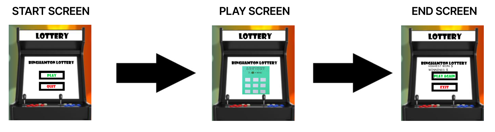
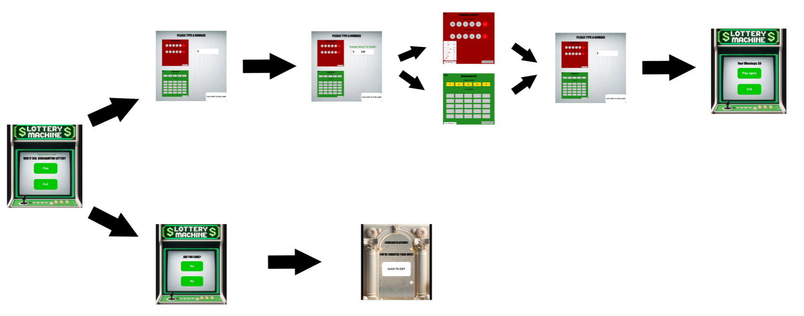

:warning: Everything between << >> needs to be replaced (remove << >> after replacing)

#  LOTTERY MACHINE 
## CS110 Final Project   SPRING, 2024 

## Team Members

Lhakpa Sherpa

***

## Project Description

The goal of this project is to make a lottery arcade game. In the game, the user inputs how much money they wish to spend on lottery tickets, setting their initial balance. After, setting their balance, the user can then click on the two displayed tickets and "purchase" them (Ticket_One:$10, Ticket_Two: $5)--the tickets are themed after universities; green for binghamton and red for stony brook--"purchasing" a ticket will take them to either an interactable lottery scratcher game or a powerball-like game. After, playing a lottery game, the user's initial balance gets reduced according to the price of the ticket, and user can decide whether they wish to continue playing the lottery by providing an end game button. The program keeps track of the user's total winnings from all their tickets, and displays their total winnings in the end screen. There will also be a high-score display that is shown in the start screen and end screen.

***    

## GUI Design

### Initial Design

### Final Design

## Program Design

### Features

1.  start menu 
2.  text input 
3.  mouse collisions 
4.  mouse clicks 
5.  game over screen 

### Classes

-    LotteryModel: Keep track of data: winnings, user inputs, high score, resets numbers for tickets
     LotteryView: Displays the lottery program images--creates images for each self.state, takes parameters of data for certain displays.
     Controller: Manages data: provides & calls LotteryView to display the data. Updates displays can creates conditions for self.state status.  

## ATP

| Step                 |Procedure             |Expected Results                   |
|----------------------|:--------------------:|----------------------------------:|
|  1                   | click on play button |        Display game screen        |
|  2                   | type 100 then press  |  Player Friendly Message Appears  |
|                      |      enter key       |                                   |
|  3                   |    click on either   |       Display ticket screen       |
|                      | image of the tickets |                                   |
|  4                   | if Binghamton pot,   |      Display Numbers with Values  |
|                      |  collide with grey   |                                   |
|                      |         rects        |                                   |
|  5                   |     collide with     |       Display next page Rect      |
|                      |   bottom right rect  |                                   |
|  6                   |   click on top-left  |        Display game screen        |
|                      |         rect         |                                   |
|  7                   |  click bottom right  |        Display end game screen    |
|                      |         rect         |                                   |
|  8                   |    click exit rect   |            End Program            |

